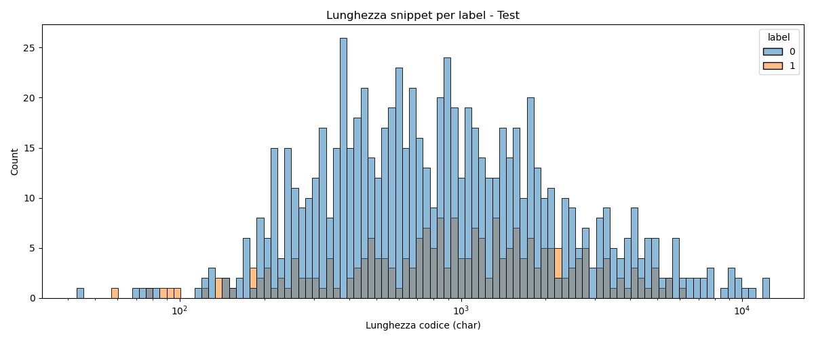
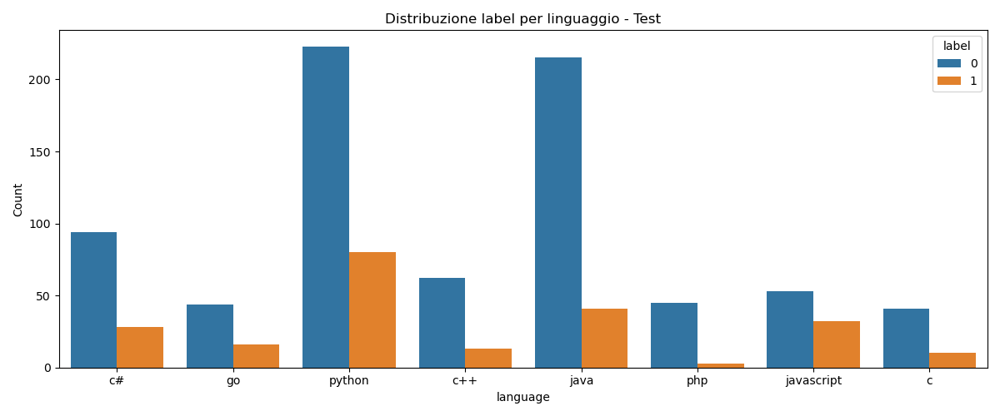
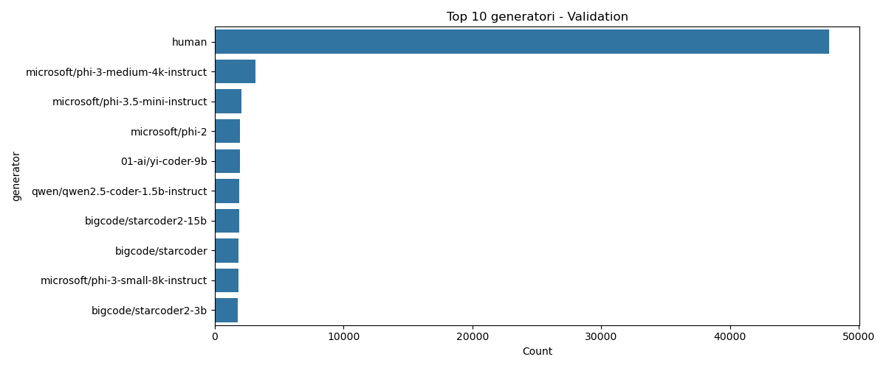
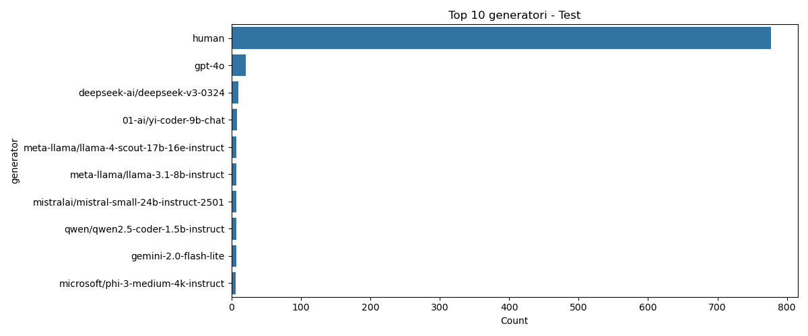

# SemEval-2026 Task 13: Subtask A - Machine-Generated Code Detection
## 📌 Obiettivo del Subtask A

Il **Subtask A** della sfida SemEval-2026 Task 13 consiste nel costruire un modello di **binary classification** in grado di distinguere codice **generato da macchina** da codice **scritto da un essere umano**.  

- **Etichette:**  
  - `0` = codice generato da macchina  
  - `1` = codice scritto da umano
- **Linguaggi di addestramento:** C++, Python, Java  
- **Dominio di addestramento:** Algoritmico (es. problemi tipo LeetCode)

L’obiettivo è valutare la capacità del modello di **generalizzare** anche su linguaggi o domini **non visti durante l’addestramento**.  

| Setting                              | Linguaggi              | Dominio                 |
|--------------------------------------|-----------------------|------------------------|
| Seen Languages & Seen Domains         | C++, Python, Java     | Algoritmico            |
| Unseen Languages & Seen Domains       | Go, PHP, C#, C, JS    | Algoritmico            |
| Seen Languages & Unseen Domains       | C++, Python, Java     | Research, Production   |
| Unseen Languages & Domains            | Go, PHP, C#, C, JS    | Research, Production   |

---

## 📝 Analisi iniziale del dataset

Per comprendere meglio i dati a disposizione, è stato creato uno script `info_dataset.py` che:

1. Carica i file `.parquet` del Subtask A (train, validation, test).  
2. Calcola alcune statistiche sui snippet di codice: lunghezza, distribuzione per linguaggio e per etichetta.  
3. Salva alcune visualizzazioni nella cartella `img` per un rapido colpo d’occhio sui dati.

---

### Esempi di risultati salvati in `img`:

Distribuzione e statistiche dei dataset Train, Validation e Test:

<div style="text-align:center">
  
  
  
</div>

<div style="text-align:center">
  
  
  
</div>

<div style="text-align:center">
  
  
  
</div>

Queste informazioni aiutano a capire:

- La predominanza del linguaggio Python nel dataset  
- Lo squilibrio relativo tra snippet umani e generati  
- Le caratteristiche generali dei generatori più comuni

---

## 🧠 Architettura del Modello e Strategia

> [!CAUTION]
> README ANCORA IN FASE DI SVILUPPO...

---

## 🚀 Istruzioni per l'Esecuzione

Il progetto include script di automazione per garantire un setup rapido e riproducibile.

### 1. Setup dell'Ambiente
Esegui lo script di preparazione che creerà la struttura delle directory, il file `.env` e l'ambiente Conda ottimizzato:

```bash
chmod +x prepare.sh
./prepare.sh
conda activate semeval
```

### 2. Configurazione

Tutti i parametri (iperparametri, path, device) sono centralizzati in `src/config/config.yaml`.

> [!NOTE]
> Assicurati di impostare correttamente `DATA_PATH` nel file `.env` generato automaticamente dallo script.

### 3. Addestramento

Per avviare la training pipeline con logging su console, TensorBoard e CometML:
```bash
python -m src_TaskA.train
```

L'output includerà una progress bar con metriche in tempo reale. Il miglior modello (basato su Macro-F1) verrà salvato automaticamente in `results/checkpoints/`.

### 4. Inferenza e Sottomissione

Per generare il file `submission.csv` valido per la leaderboard:
```bash
python -m src_TASKA.generate_submission
```
Lo script rileva automaticamente il file `test.parquet` (cercandolo anche nelle sottocartelle di download Kaggle) e genera il file in `results/submission/submission_task_a.csv`.

---

## 📊 Struttura del Progetto Sub Task-A

```bash
 IN FASE DI SVILUPPO
```

--- 

<!--───────────────────────────────────────────────-->
<!--                   AUTORE                     -->
<!--───────────────────────────────────────────────-->

<h2 align="center">✨ Autore ✨</h2>

<p align="center">
  <strong>Giovanni Giuseppe Iacuzzo</strong><br>
  <em>Studente di Ingegneria Dell'IA e della CyberSecurity · Università degli Studi Kore di Enna</em>
</p>

<p align="center">
  <a href="https://github.com/giovanniIacuzzo" target="_blank">
    
  </a>
  <a href="mailto:giovanni.iacuzzo@unikorestudent.com">
    
  </a>
</p>