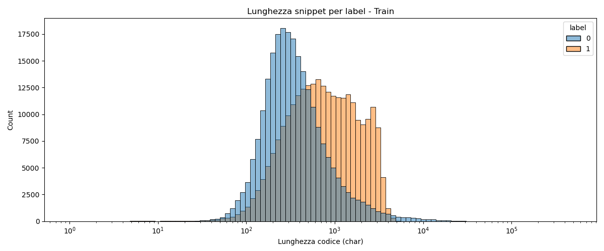
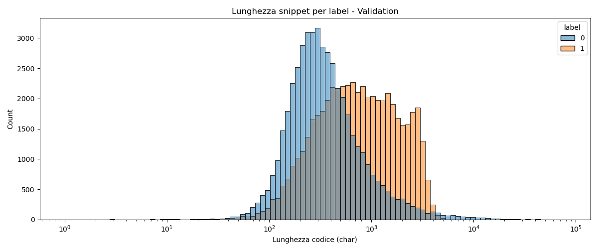
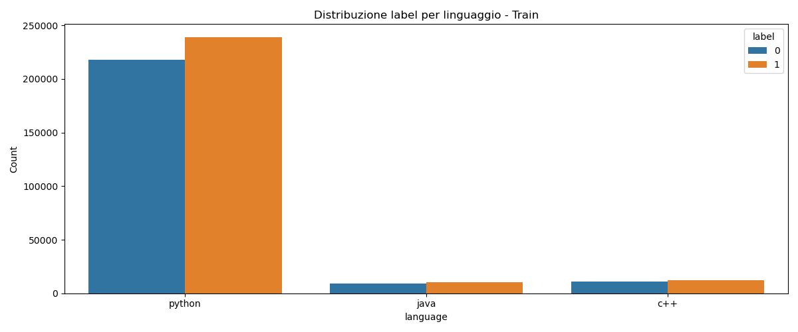
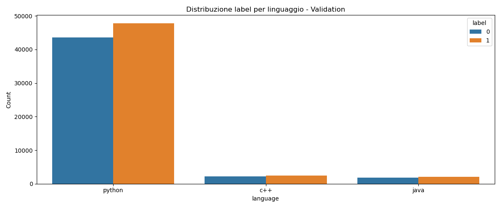
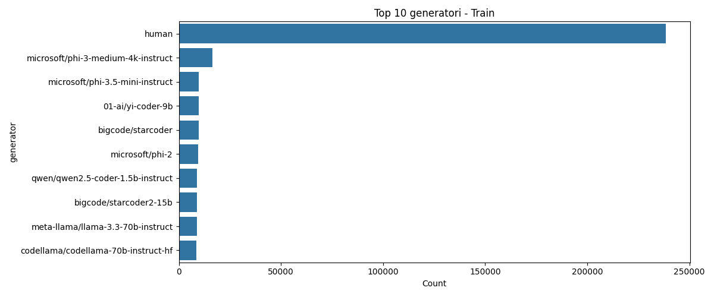
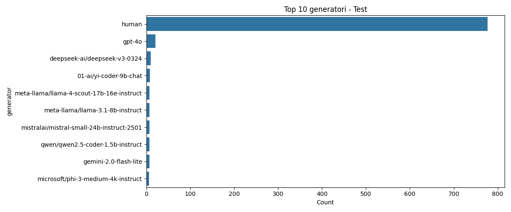
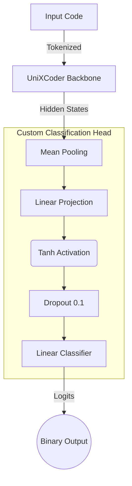

# SemEval-2026 Task 13: Subtask A - Machine-Generated Code Detection
## 📌 Obiettivo del Subtask A

Il **Subtask A** della sfida SemEval-2026 Task 13 consiste nel costruire un modello di **binary classification** in grado di distinguere codice **generato da macchina** da codice **scritto da un essere umano**.  

- **Etichette:**  
  - `0` = codice generato da macchina  
  - `1` = codice scritto da umano
- **Linguaggi di addestramento:** C++, Python, Java  
- **Dominio di addestramento:** Algoritmico (es. problemi tipo LeetCode)

L’obiettivo è valutare la capacità del modello di **generalizzare** anche su linguaggi o domini **non visti durante l’addestramento**.  

| Setting                              | Linguaggi              | Dominio                 |
|--------------------------------------|-----------------------|------------------------|
| Seen Languages & Seen Domains         | C++, Python, Java     | Algoritmico            |
| Unseen Languages & Seen Domains       | Go, PHP, C#, C, JS    | Algoritmico            |
| Seen Languages & Unseen Domains       | C++, Python, Java     | Research, Production   |
| Unseen Languages & Domains            | Go, PHP, C#, C, JS    | Research, Production   |

---

## 📝 Analisi iniziale del dataset

Per comprendere meglio i dati a disposizione, è stato creato uno script `info_dataset.py` che:

1. Carica i file `.parquet` del Subtask A (train, validation, test).  
2. Calcola alcune statistiche sui snippet di codice: lunghezza, distribuzione per linguaggio e per etichetta.  
3. Salva alcune visualizzazioni nella cartella `img` per un rapido colpo d’occhio sui dati.

---

### Esempi di risultati salvati in `img`:

Distribuzione e statistiche dei dataset Train, Validation e Test:

<div style="text-align:center">
  
  
  
</div>

<div style="text-align:center">
  
  
  
</div>

<div style="text-align:center">
  
  
  
</div>

Queste informazioni aiutano a capire:

- La predominanza del linguaggio Python nel dataset  
- Lo squilibrio relativo tra snippet umani e generati  
- Le caratteristiche generali dei generatori più comuni

---

---

## 🧠 Architettura del Modello e Strategia

Per affrontare la sfida della generalizzazione su linguaggi non visti (**OOD - Out Of Distribution**), abbiamo evitato l'approccio standard "black-box", progettando un'architettura che forza il modello a imparare la **semantica strutturale** del codice piuttosto che memorizzare la sintassi specifica di un linguaggio.

### 1. Il Core: Microsoft UniXCoder
Abbiamo scelto **UniXCoder-base** come backbone. A differenza di modelli puramente encoder-only (come CodeBERT), UniXCoder utilizza un approccio unificato che beneficia di tre obiettivi di pre-training:
1.  **Masked Language Modeling:** Per capire il contesto locale.
2.  **Unidirectional LM:** Per la generazione.
3.  **Contrastive Learning:** Per allineare rappresentazioni simili.

Questo lo rende eccezionalmente robusto nel comprendere snippet di codice incompleti o rumorosi.

### 2. Custom Head & Pooling Strategy
Invece di affidarci al solo token `[CLS]` (che nei Transformer standard tende a soffrire di bias su dati mai visti), abbiamo implementato una strategia di **Mean Pooling**:



### 3. Approccio "Language Agnostic"
Una scelta critica è stata la **rimozione esplicita degli embedding del linguaggio**.
Nel codice di training abbiamo rimosso i `lang_ids`. Questo "handicap" intenzionale costringe la rete a imparare pattern intrinseci (es. complessità ciclomatica, stile di naming, struttura logica) che distinguono l'AI dall'umano, permettendo una migliore generalizzazione su linguaggi ignoti nel test set (es. Go, PHP).

---

## 🛡️ Data Augmentation & Robustezza

Per prevenire l'overfitting e simulare la variabilità del mondo reale, abbiamo implementato una pipeline di augmentation dinamica all'interno di `CodeDataset`.

| Tecnica | Descrizione | Perché aiuta nel Task 13? |
| :--- | :--- | :--- |
| **Random Cropping** | Se il codice supera i 384 token, invece di troncare la fine, estraiamo una **finestra casuale** (Sliding Window). | Il modello impara a riconoscere lo stile AI/Umano anche dal corpo delle funzioni, non solo dagli `import` o dalle intestazioni. |
| **Smart Token Masking** | Mascheramento probabilistico (15%) dei token di input (simile a BERT), sostituendoli con `[MASK]`. | Costringe il modello a ricostruire il contesto basandosi sulla struttura, riducendo la dipendenza da keyword specifiche (utile per linguaggi Unseen). |

---

## ⚡ Ottimizzazione Hardware (Apple Silicon M2)

Il progetto è stato ingegnerizzato per girare efficientemente su hardware consumer (MacBook con chip M1/M2/M3) utilizzando **MPS (Metal Performance Shaders)**, superando i limiti della memoria unificata.

Le tecniche implementate nel file `src/models/model.py` includono:

- **Mixed Precision (FP16):** Utilizzo dinamico di `torch.amp.autocast` per ridurre l'uso della VRAM e accelerare i calcoli matriciali su Neural Engine.
- **Gradient Checkpointing:** Scambia tempo di calcolo per memoria, permettendo l'addestramento di modelli Transformer profondi su dispositivi con RAM limitata (evita errori OOM).
- **Gradient Accumulation:** Simula una batch size elevata (es. 32) accumulando i gradienti su più step fisici (micro-batch di 8), stabilizzando la convergenza senza saturare la memoria.
- **DataLoader Ottimizzati:** Configurazione di `num_workers=2`, `pin_memory=False` (specifico per MPS) e `persistent_workers` per ottimizzare il throughput I/O.

---

## 🚀 Istruzioni per l'Esecuzione

Il progetto include script di automazione per garantire un setup rapido e riproducibile.

### 1. Setup dell'Ambiente
Esegui lo script di preparazione che creerà la struttura delle directory, il file `.env` e l'ambiente Conda ottimizzato:

```bash
chmod +x prepare.sh
./prepare.sh
conda activate semeval
```

### 2. Configurazione

Tutti i parametri (iperparametri, path, device) sono centralizzati in `src/config/config.yaml`.

> [!NOTE]
> Assicurati di impostare correttamente `DATA_PATH` nel file `.env` generato automaticamente dallo script.

### 3. Addestramento

Per avviare la training pipeline con logging su console, TensorBoard e CometML:
```bash
python src/train.py
```

L'output includerà una progress bar con metriche in tempo reale. Il miglior modello (basato su Macro-F1) verrà salvato automaticamente in `results/checkpoints/`.

### 4. Inferenza e Sottomissione

Per generare il file `submission.csv` valido per la leaderboard:
```bash
python src/generate_submission.py
```
Lo script rileva automaticamente il file `test.parquet` (cercandolo anche nelle sottocartelle di download Kaggle) e genera il file in `results/submission/submission_task_a.csv`.

---

## 📊 Struttura del Progetto Sub Task-A

```bash
├── 📁 img_TaskA
│   ├── 🖼️ Test_label_language.png
│   ├── 🖼️ Test_length_label.png
│   ├── 🖼️ Test_top_generators.png
│   ├── 🖼️ Train_Sampled_label_language.png
│   ├── 🖼️ Train_Sampled_length_label.png
│   ├── 🖼️ Train_label_language.png
│   ├── 🖼️ Train_length_label.png
│   ├── 🖼️ Train_top_generators.png
│   ├── 🖼️ Validation_Sampled_label_language.png
│   ├── 🖼️ Validation_Sampled_length_label.png
│   ├── 🖼️ Validation_label_language.png
│   ├── 🖼️ Validation_length_label.png
│   └── 🖼️ Validation_top_generators.png
│
├── 📁 src_TaskA
│   ├── 📁 config
│   │   └── ⚙️ config.yaml
│   │
│   ├── 📁 dataset
│   │   ├── 🐍 Inference_dataset.py
│   │   └── 🐍 dataset.py
│   │
│   ├── 📁 models
│   │   └── 🐍 model.py
│   │
│   ├── 📁 utils
│   │   └── 🐍 utils.py
│   │
│   ├── 🐍 check_model.py
│   ├── 🐍 generate_submission.py
│   ├── 🐍 inference.py
│   └── 🐍 train.py
│
├── ⚙️ .gitignore
├── 📝 README.md
│
├── ⚙️ environment.yml
│
├── 🐍 info_dataset.py
│
└── 📄 prepare.sh
```

--- 

<!--───────────────────────────────────────────────-->
<!--                   AUTORE                     -->
<!--───────────────────────────────────────────────-->

<h2 align="center">✨ Autore ✨</h2>

<p align="center">
  <strong>Giovanni Giuseppe Iacuzzo</strong><br>
  <em>Studente di Ingegneria Dell'IA e della CyberSecurity · Università degli Studi Kore di Enna</em>
</p>

<p align="center">
  <a href="https://github.com/giovanniIacuzzo" target="_blank">
    
  </a>
  <a href="mailto:giovanni.iacuzzo@unikorestudent.com">
    
  </a>
</p>