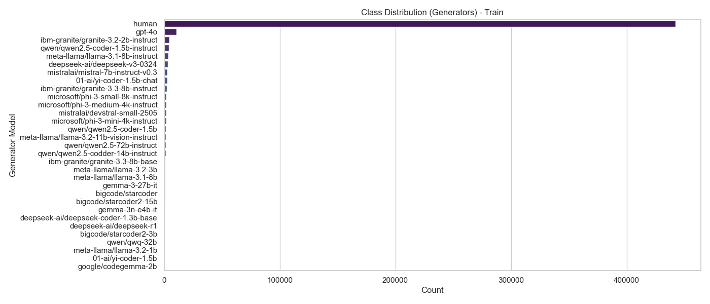
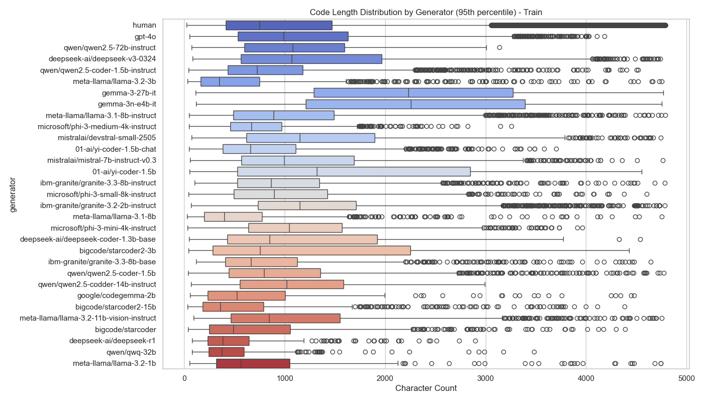
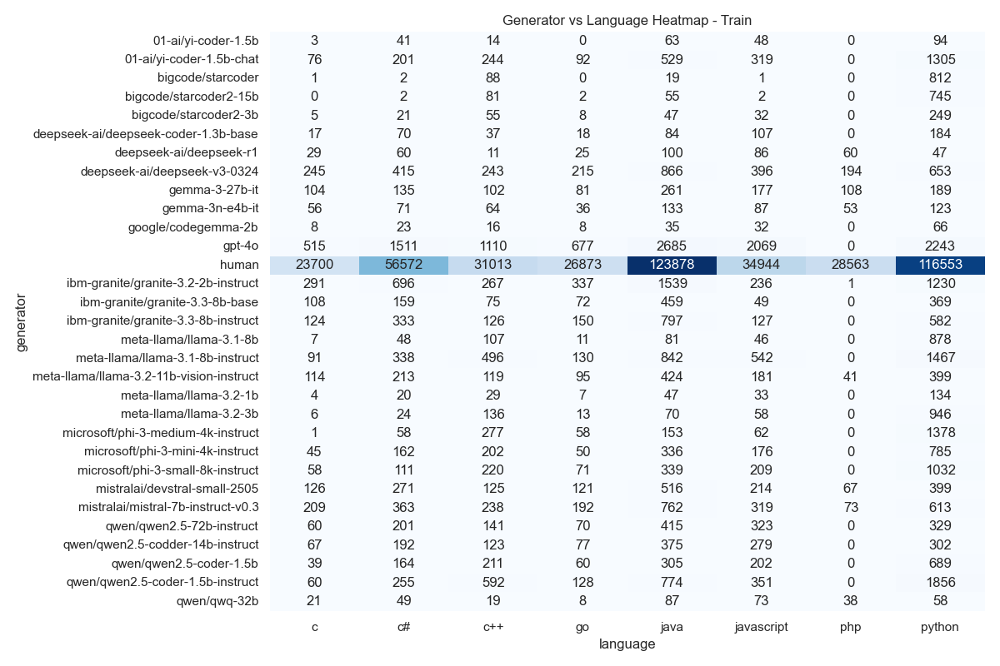

# SemEval-2026 Task 13: Subtask B - Multi-Class Authorship Detection

## 📌 Obiettivo del Subtask B

Mentre il Subtask A si limitava a distinguere "Umano vs Macchina", il **Subtask B** alza l'asticella richiedendo una **Fine-Grained Classification**. L'obiettivo è identificare **quale specifico modello** (o se un umano) ha generato un determinato snippet di codice.

1. **Tipo di Task**: Multi-Class Classification (31+ Classi)

2. **Target**: Identificare il `generator` specifico (es. `gpt-4o`, `llama-3`.`1-8b`, `starcoder`, `human`).

3. **Sfida Principale**: Il dataset è sbilanciato e il test set contiene generatori **OOD (Out-Of-Distribution)**, ovvero modelli mai visti durante il training (es. `gpt-4o-mini`, `phi-4`).

---

## 📝 Analisi del Dataset (Task B)

L'analisi esplorativa è stata condotta tramite lo script dedicato src/info_dataset_task_b.py, fondamentale per mappare le etichette testuali in indici numerici (GENERATOR_MAP).

Insight Grafici:

 
   
  
<em>Distribuzione sbilanciata delle classi: 'Human' è predominante, seguita da GPT-4o.</em>
 

 
 
     
     
  
 
  
<em>Analisi della verbosità dei modelli (Boxplot) e correlazione Generatore/Linguaggio (Heatmap).</em>
 

---

> [!CAUTION]
> Questo readme è ancora in fase di sviluppo.
---

<!--───────────────────────────────────────────────-->
<!--                   AUTORE                     -->
<!--───────────────────────────────────────────────-->

<h2 align="center">✨ Autore ✨</h2>

  <strong>Giovanni Giuseppe Iacuzzo</strong> 
  <em>Studente di Ingegneria Dell'IA e della CyberSecurity · Università degli Studi Kore di Enna</em>

  
  

