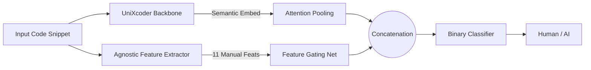

# SemEval-2026 Task 13: Subtask A - Machine-Generated Code Detection
## 📌 Obiettivo del Subtask A

<div align="center">
  <a href="README.md">
    
  </a>
</div>

Il **Subtask A** della sfida SemEval-2026 Task 13 consiste nel costruire un modello di **binary classification** in grado di distinguere codice **generato da macchina** da codice **scritto da un essere umano**.  

- **Etichette:**  
  - `0` = codice generato da macchina  
  - `1` = codice scritto da umano
- **Linguaggi di addestramento:** C++, Python, Java  
- **Dominio di addestramento:** Algoritmico (es. problemi tipo LeetCode)

L’obiettivo è valutare la capacità del modello di **generalizzare** anche su linguaggi o domini **non visti durante l’addestramento**.  

| Setting                              | Linguaggi              | Dominio                 |
|--------------------------------------|-----------------------|------------------------|
| Seen Languages & Seen Domains         | C++, Python, Java     | Algoritmico            |
| Unseen Languages & Seen Domains       | Go, PHP, C#, C, JS    | Algoritmico            |
| Seen Languages & Unseen Domains       | C++, Python, Java     | Research, Production   |
| Unseen Languages & Domains            | Go, PHP, C#, C, JS    | Research, Production   |

---

## 📝 Analisi iniziale del dataset

Per comprendere meglio i dati a disposizione, è stato creato uno script `info_dataset.py` che:

1. Carica i file `.parquet` del Subtask A (train, validation, test).  
2. Calcola alcune statistiche sui snippet di codice: lunghezza, distribuzione per linguaggio e per etichetta.  
3. Salva alcune visualizzazioni nella cartella `img` per un rapido colpo d’occhio sui dati.

---

### Esempi di risultati salvati in `img`:

Distribuzione e statistiche dei dataset Train, Validation e Test:

<div style="text-align:center">
  
  
  
</div>

<div style="text-align:center">
  
  
  
</div>

<div style="text-align:center">
  
  
  
</div>

Queste informazioni aiutano a capire:

- La predominanza del linguaggio Python nel dataset  
- Lo squilibrio relativo tra snippet umani e generati  
- Le caratteristiche generali dei generatori più comuni

---

## ⚙️ Metodologia e Architettura
Per il task di identificazione binaria (`Human vs AI`), l'obiettivo principale è stato massimizzare la capacità di generalizzazione del modello, evitando l'overfitting su specifici pattern lessicali. È stata sviluppata un'architettura Ibrida `Semantico-Stilometrica` che combina la comprensione profonda del codice di un Transformer con feature stilistiche esplicite.

### 1. Hybrid Fusion Architecture

Il modello non si affida esclusivamente all'embedding del codice generato da un LLM, ma integra un vettore di feature "`agnostiche`" che catturano la "`firma`" statistica del generatore.



### 2. Componenti del Modello

L'architettura, definita nella classe `HybridClassifier`, si compone di tre moduli distinti:

- **Semantic Branch (UniXcoder + Attention)**: Utilizza `microsoft/unixcoder-base` come backbone. Al posto del classico pooling sul token `[CLS]`, è stato implementato un **Attention Pooling** custom. Questo meccanismo apprende dinamicamente quali token sono più rilevanti per la classificazione, generando una somma pesata degli hidden states che cattura meglio le sfumature semantiche rispetto al pooling statico.

- **Stylometric Branch (Feature Gating)**: Un modulo parallelo (`FeatureGatingNetwork`) basato su un MLP con attivazioni **Mish** e **BatchNorm**, progettato per proiettare le 11 feature manuali (vedi punto 3) in uno spazio latente a 128 dimensioni, rendendole compatibili per la fusione con l'embedding semantico.

- **Late Fusion**: I due vettori (Semantico e Stilometrico) vengono concatenati e passati a una classification head finale. Questo permette al modello di "correggere" le allucinazioni semantiche usando segnali statistici forti (es. perplessità o entropia).

### 3. Feature Engineering Avanzato

L'estrattore (`AgnosticFeatureExtractor`) calcola un vettore di 11 feature per ogni snippet, divise in tre categorie:

- **Metrica Neurale (Perplexity)**: Viene utilizzata una versione quantizzata di **Qwen2.5-Coder-1.5B** per calcolare la perplessità del codice. Il razionale è che il codice generato da AI tende ad avere una perplessità statistica inferiore (più "prevedibile" per un altro LLM) rispetto al codice umano creativo o "sporco".

- **Analisi degli Identificatori**: Calcolo dell'entropia dei nomi di variabili, ratio di identificatori corti (es. `i`, `x`) e presenza di numeri nei nomi (es. `var1`), che spesso distinguono lo stile umano legacy.

- **Struttura e Coerenza**:

  - Consistency Score: Misura se lo snippet mischia SnakeCase e CamelCase (tipico umano) o è perfettamente coerente (tipico AI).

  - Spacing Ratio: Analizza la spaziatura attorno agli operatori (es. `a=b` vs `a = b`).

  - Human Markers: Regex per individuare commenti tipici come `TODO`, `FIXME`, `HACK`.

### 4. Strategie di Training

- **Loss Ibrida (Task + SupCon)**: La loss finale è una somma pesata: `Loss = Task_Loss + 0.1 * SupCon_Loss`. L'uso della **Supervised Contrastive Loss** aiuta a clusterizzare nello spazio vettoriale gli esempi umani rispetto a quelli AI prima ancora del layer di classificazione, migliorando la robustezza del decision boundary.

- **Data Augmentation (Random Cropping)**: Per gestire snippet lunghi senza perdere informazioni, in fase di training viene effettuato un random crop dello snippet alla lunghezza massima (512 token) invece di un troncamento statico. Questo espone il modello a parti diverse del codice (intestazioni, logica centrale, chiusure) aumentando la varianza dei dati.

- **Feature Normalization**: Le feature numeriche (come la perplessità o la lunghezza media) vengono normalizzate tramite trasformazione logaritmica (`log1p`) e clipping, per evitare che valori outlier destabilizzino i gradienti della rete neurale.

---

## 🚀 Istruzioni per l'Esecuzione

### 0. Inizio
Prima di avviare il train lanciare il codice per preparare le featurs:
```bash
python -m src.src_TaskA.dataset.prepare_features
```

### 1. Addestramento
Dopo aver lanciato `prepare_features`, per avviare la training pipeline con logging su console, TensorBoard e CometML:
```bash
python -m src.src_TaskA.train
```

L'output includerà una progress bar con metriche in tempo reale. Il miglior modello (basato su Macro-F1) verrà salvato automaticamente in `results/results_TaskA/checkpoints/`.

### 2. Inferenza e Sottomissione

Per generare il file `submission_task_a.csv` valido per la leaderboard:
```bash
python -m src.src_TaskA.generate_submission
```
Lo script rileva automaticamente il file `test.parquet` (cercandolo anche nelle sottocartelle di download Kaggle) e genera il file in `results/results_TaskA/submission/submission_task_a.csv`.

---

## 📊 Struttura del Progetto Sub Task-A

```bash
├── 📁 src
│   └── 📁 src_TaskA
│       ├── 📁 config
│       │   └── ⚙️ config.yaml
│       │
│       ├── 📁 dataset
│       │   ├── 🐍 Inference_dataset.py
│       │   ├── 🐍 preprocess_features.py
│       │   └── 🐍 dataset.py
│       │
│       ├── 📁 features
│       │   └── 🐍 stylometry.py
│       │
│       ├── 📁 models
│       │   └── 🐍 model.py
│       │
│       ├── 📁 scripts
│       │   ├── 🐍 augment_data.py
│       │   └── 🐍 debug_data.py
│       │
│       ├── 📁 utils
│       │   └── 🐍 utils.py
│       │
│       ├── 📝 README.md
│       │
│       ├── 🐍 generate_submission.py
│       ├── 🐍 inference.py
│       │
│       └── 🐍 train.py
```

--- 

<!--───────────────────────────────────────────────-->
<!--                   AUTORE                     -->
<!--───────────────────────────────────────────────-->

<h2 align="center">✨ Autore ✨</h2>

<p align="center">
  <strong>Giovanni Giuseppe Iacuzzo</strong><br>
  <em>Studente di Ingegneria Dell'IA e della CyberSecurity · Università degli Studi Kore di Enna</em>
</p>

<p align="center">
  <a href="https://github.com/giovanniIacuzzo" target="_blank">
    
  </a>
  <a href="mailto:giovanni.iacuzzo@unikorestudent.com">
    
  </a>
</p>