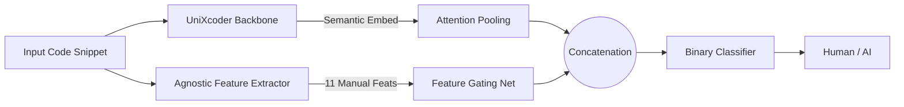

# SemEval-2026 Task 13: Subtask A - Machine-Generated Code Detection
## 📌 Subtask A Objective

<div align="center">
  <a href="README.it.md">
    
  </a>
</div>

**Subtask A** of the SemEval-2026 Task 13 challenge consists of building a **binary classification** model capable of distinguishing **machine-generated** code from **human-written** code.

- **Labels:** - `0` = machine-generated code  
  - `1` = human-written code
- **Training Languages:** C++, Python, Java  
- **Training Domain:** Algorithmic (e.g., LeetCode-style problems)

The goal is to evaluate the model's ability to **generalize** to languages or domains **not seen during training**.

| Setting                              | Languages              | Domain                 |
|--------------------------------------|-----------------------|------------------------|
| Seen Languages & Seen Domains         | C++, Python, Java     | Algorithmic            |
| Unseen Languages & Seen Domains       | Go, PHP, C#, C, JS    | Algorithmic            |
| Seen Languages & Unseen Domains       | C++, Python, Java     | Research, Production   |
| Unseen Languages & Domains            | Go, PHP, C#, C, JS    | Research, Production   |

---

## 📝 Initial Dataset Analysis

To better understand the available data, an `info_dataset.py` script was created that:

1. Loads the `.parquet` files for Subtask A (train, validation, test).  
2. Calculates statistics on code snippets: length, distribution by language, and by label.  
3. Saves visualizations in the `img` folder for a quick overview of the data.

---

### Examples of results saved in `img`:

Distribution and statistics for Train, Validation, and Test datasets:

<div style="text-align:center">
  
  
  
</div>

<div style="text-align:center">
  
  
  
</div>

<div style="text-align:center">
  
  
  
</div>

This information helps to understand:

- The predominance of Python in the dataset.
- The relative imbalance between human and generated snippets.
- The general characteristics of the most common generators.

---

## ⚙️ Methodology and Architecture

For the binary identification task (`Human vs AI`), the primary objective was to maximize the model's generalization capability, avoiding overfitting on specific lexical patterns. A Hybrid `Semantic-Stylometric` architecture was developed, combining the deep code understanding of a Transformer with explicit stylistic features.

### 1. Hybrid Fusion Architecture

The model does not rely exclusively on the code embedding generated by an LLM but integrates a vector of `agnostic` features that capture the statistical `signature` of the generator.


### 2. Model Components

The architecture, defined within the `HybridClassifier` class, consists of three distinct modules:

- **Semantic Branch (UniXcoder + Attention)**: Uses `microsoft/unixcoder-base` as the backbone. Instead of standard pooling on the `[CLS]` token, a custom **Attention Pooling** mechanism was implemented. This dynamically learns which tokens are most relevant for classification, generating a weighted sum of hidden states that captures semantic nuances better than static pooling.

- **Stylometric Branch (Feature Gating)**: A parallel module (`FeatureGatingNetwork`) based on an MLP with **Mish** activations and **BatchNorm**, designed to project the 11 manual features (see point 3) into a 128-dimensional latent space, making them compatible for fusion with the semantic embedding.

- **Late Fusion**: The two vectors (Semantic and Stylometric) are concatenated and passed to a final classification head. This allows the model to "correct" semantic hallucinations using strong statistical signals (e.g., perplexity or entropy).

### 3. Advanced Feature Engineering

The extractor (`AgnosticFeatureExtractor`) calculates an 11-feature vector for each snippet, divided into three categories:

- **Neural Metric (Perplexity)**: A quantized version of **Qwen2.5-Coder-1.5B** is used to calculate code perplexity. The rationale is that AI-generated code tends to have lower statistical perplexity (more "predictable" for another LLM) compared to creative or "messy" human code.

- **Identifier Analysis**: Calculation of variable name entropy, ratio of short identifiers (e.g., `i`, `x`), and presence of numbers in names (e.g., `var1`), which often distinguish legacy human style.

- **Structure and Consistency**:

  - *Consistency Score*: Measures whether the snippet mixes SnakeCase and CamelCase (typical of humans) or is perfectly consistent (typical of AI).

  - *Spacing Ratio*: Analyzes spacing around operators (e.g., `a=b` vs `a = b`).

  - *Human Markers*: Regex to identify typical comments like `TODO`, `FIXME`, `HACK`.

### 4. Training Strategies

- **Hybrid Loss (Task + SupCon)**: The final loss is a weighted sum: `Loss = Task_Loss + 0.1 * SupCon_Loss`. The use of **Supervised Contrastive Loss** helps cluster human examples against AI examples in the vector space even before the classification layer, improving the robustness of the decision boundary.

- **Data Augmentation (Random Cropping)**: To handle long snippets without losing information, a **random crop** of the snippet to the maximum length (512 tokens) is performed during training instead of static truncation. This exposes the model to different parts of the code (headers, core logic, closures), increasing data variance.

- **Feature Normalization**: Numerical features (such as perplexity or average length) are normalized via logarithmic transformation (`log1p`) and clipping to prevent outlier values from destabilizing the neural network gradients.

---

## 🚀 Execution Instructions

### 0. Initialization
Before starting the training, run the code to prepare the features:
```bash
python -m src.src_TaskA.dataset.prepare_features
```

### 1. Training
To start the training pipeline with logging to console, TensorBoard, and CometML:
```bash
python -m src.src_TaskA.train
```

The output will include a progress bar with real-time metrics. The best model (based on Macro-F1) will be automatically saved in `results/results_TaskA/checkpoints/`.

### 2. Inference and Submission

To generate the valid `submission_task_a.csv` file for the leaderboard:
```bash
python -m src.src_TaskA.generate_submission
```
The script automatically detects the `test.parquet` file (searching also within Kaggle download subfolders) and generates the file in `results/results_TaskA/submission/submission_task_a.csv`.

---

## 📊 Repository Structure Sub Task-A

```bash
├── 📁 src
│   └── 📁 src_TaskA
│       ├── 📁 config
│       │   └── ⚙️ config.yaml
│       │
│       ├── 📁 dataset
│       │   ├── 🐍 Inference_dataset.py
│       │   ├── 🐍 preprocess_features.py
│       │   └── 🐍 dataset.py
│       │
│       ├── 📁 features
│       │   └── 🐍 stylometry.py
│       │
│       ├── 📁 models
│       │   └── 🐍 model.py
│       │
│       ├── 📁 scripts
│       │   ├── 🐍 augment_data.py
│       │   └── 🐍 debug_data.py
│       │
│       ├── 📁 utils
│       │   └── 🐍 utils.py
│       │
│       ├── 📝 README.md
│       │
│       ├── 🐍 generate_submission.py
│       ├── 🐍 inference.py
│       │
│       └── 🐍 train.py
```

--- 

<!--───────────────────────────────────────────────-->
<!--                   AUTORE                     -->
<!--───────────────────────────────────────────────-->

<div align="center">
  <h2>✨ Autore ✨</h2>

  <p>
    <strong>Giovanni Giuseppe Iacuzzo</strong><br>
    <em>AI & Cybersecurity Engineering Student</em><br>
    <em>University of Kore, Enna</em>
  </p>

  <p>
    <a href="https://github.com/giovanniIacuzzo" target="_blank">
      
    </a>
    <a href="mailto:giovanni.iacuzzo@unikorestudent.com">
      
    </a>
  </p>
</div>