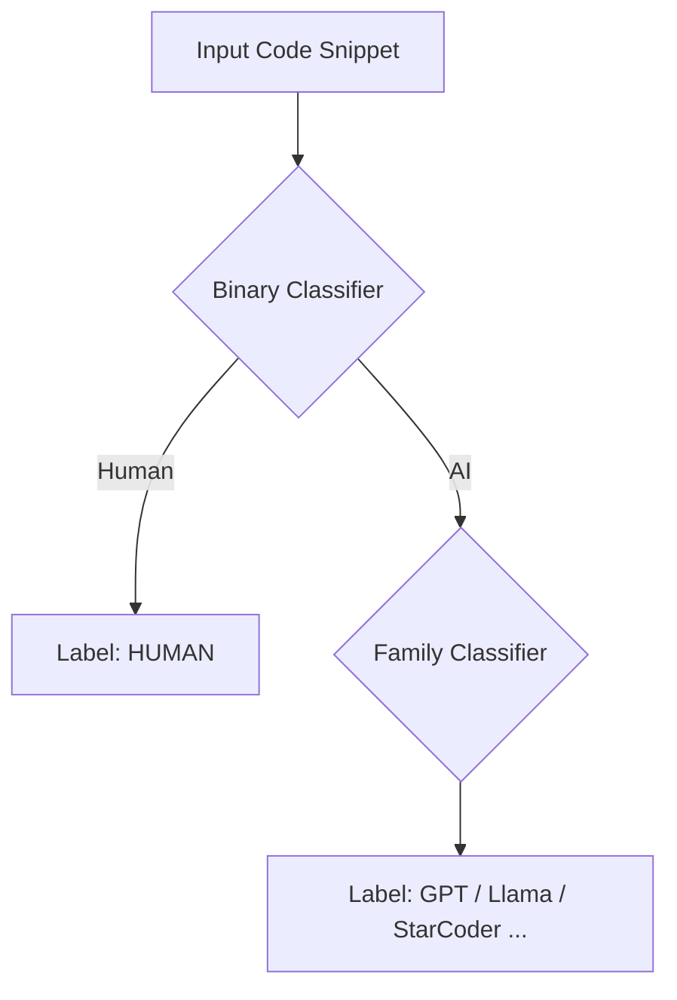

# SemEval-2026 Task 13: Subtask B - Multi-Class Authorship Detection

## 📌 Obiettivo del Subtask B

<div align="center">
  <a href="README.md">
    
  </a>
</div>

A differenza del Subtask A (binario), il **Subtask B** affronta una sfida di **Fine-Grained Classification**. L'obiettivo è identificare **quale specifico autore** (umano o modello AI) ha generato un determinato snippet di codice.

- **Etichette:** 11 classi (es. `human`, `gpt-4o`, `llama-3.1-8b`, `starcoder`, ecc.)
- **Input:** Snippet di codice sorgente multilingua
- **Sfida principale:** Il dataset presenta un forte sbilanciamento e include scenari **OOD (Out-Of-Distribution)**.

Il modello deve non solo distinguere tra i generatori noti, ma gestire in modo robusto la presenza di modelli mai visti durante il training nel set di test.

| Setting | Generatori | Obiettivo |
| :--- | :--- | :--- |
| **In-Distribution (ID)** | Presenti nel Train | Classificare correttamente l'autore esatto |
| **Out-Of-Distribution (OOD)** | Assenti nel Train | Generalizzazione o Rilevamento OOD |
| **Class Imbalance** | Human >>> AI Models | Gestire la predominanza della classe `human` |

---

## 📝 Analisi iniziale del dataset

Per analizzare la complessità del task multiclasse, è stato sviluppato lo script `info_dataset_subTaskB.py` che:

1.  Carica i dataset (Train, Validation, Test) e normalizza le etichette dei generatori.
2.  Effettua un controllo sui **duplicati** per evitare *data leakage* tra i set.
3.  Genera metriche avanzate come la **lunghezza in token** (approssimata) e la correlazione **Linguaggio-Generatore**.
4.  Produce il dizionario `GENERATOR_MAP` necessario per la fase di training.

---

### Esempi di risultati salvati in `img_TaskB`:

**1. Distribuzione delle Classi (Train vs Validation)**
Evidenzia il forte sbilanciamento verso la classe *Human* e le differenze di frequenza tra i vari modelli AI.

<div style="text-align:center">
  
  
  
</div>

<br>

**2. Verbosità dei Modelli (Lunghezza in Token)**
Confronto della lunghezza media dei codici prodotti. I Boxplot (ordinati per mediana) mostrano come alcuni modelli (es. GPT-4o) tendano a essere più "prolissi" di altri.

<div style="text-align:center">
  
  
  
</div>

<br>

**3. Heatmap Normalizzata (Generatore vs Linguaggio)**
Mostra la probabilità condizionata che un certo generatore produca codice in un determinato linguaggio. Utile per identificare modelli specializzati (es. solo Python) rispetto a quelli generalisti.

<div style="text-align:center">
  
  
  
</div>

Queste informazioni aiutano a capire:

- La necessità di tecniche di **re-sampling** o **loss ponderata** dato lo sbilanciamento.
- L'importanza della **lunghezza del codice** come feature discriminante.
- La struttura delle correlazioni tra modelli e linguaggi di programmazione.

---

## ⚙️ Metodologia e Architettura

Per affrontare la complessità del task e il forte sbilanciamento verso la classe *Human*, è stata implementata una **Pipeline a Cascata (Cascade Inference)** basata su un'architettura ibrida neurale.

### 1. Cascade Ensemble Strategy

Invece di un singolo classificatore a 11 classi, il problema è stato diviso in due stadi logici per massimizzare la precisione:



- **Stage 1 (Binary)**: Un modello specializzato distingue solo tra `Human` vs `AI`. Questo protegge dai falsi positivi AI su codice umano (la classe maggioritaria).

- **Stage 2 (Families)**: Se il primo modello predice "AI", lo snippet passa a un secondo modello addestrato esclusivamente sulle famiglie di LLM (escludendo gli umani) per identificare la famiglia specifica.

### 2. Custom Model Architecture

Il cuore del sistema è una classe custom `CodeClassifier` che estende **UniXcoder-base** (`microsoft/unixcoder-base`) con componenti specifici per l'attribuzione di paternità:

- **Attention Pooling**: Invece di usare solo il token `[CLS]`, viene calcolata una somma pesata di tutti i token basata sulla loro rilevanza, catturando meglio pattern stilistici diffusi nel codice.

- **Stylistic Features Injection**: Vengono estratte **8 feature stilistiche manuali** (es. densità di commenti, snake_case vs camelCase, indentazione media, token logici) e proiettate in uno spazio latente tramite uno `StyleProjector`.

- **Feature Fusion**: L'embedding semantico (UniXcoder) e l'embedding stilistico vengono concatenati prima della classificazione.

### 3. Strategie di Training

**Supervised Contrastive Learning (SupCon)**: Nel training delle Families, viene utilizzata una loss contrastiva per avvicinare nello spazio vettoriale gli snippet della stessa famiglia e allontanare quelli diversi, migliorando la separazione tra modelli simili (es. Llama vs Mistral).

**Focal Loss**: Utilizzata al posto della CrossEntropy standard per penalizzare gli errori sulle classi difficili/rare e gestire lo sbilanciamento del dataset.

**Mixed Precision & Gradient Accumulation**: Training ottimizzato in FP16 con accumulo dei gradienti per simulare batch size più grandi su GPU consumer.

---

## 🚀 Istruzioni per l'Esecuzione

### 1. Addestramento

Per avviare la training pipeline con logging su console, TensorBoard e CometML:
```bash
python -m src.src_TaskB.train --mode binary
```
Successivamente dopo aver fatto il train binario dovrai:
```bash
python -m src.src_TaskB.train --mode families
```

L'output includerà una progress bar con metriche in tempo reale. Il miglior modello (basato su Macro-F1) verrà salvato automaticamente in `results/results_TaskB/checkpoints/`.

### 2. Inferenza e Sottomissione

Per generare il file `submission_task_b.csv` valido per la leaderboard:
```bash
python -m src.src_TaskB.generate_submission \
  --test_file data/data_TaskB/test.parquet \
  --ckpt_binary results/results_TaskB/checkpoints/binary/best_model \
  --ckpt_families results/results_TaskB/checkpoints/families/best_model \
  --data_dir data/Task_B_Processed \
  --output_file results/results_TaskB/submission/submission_task_b.csv
```
Lo script rileva automaticamente il file `test.parquet` (cercandolo anche nelle sottocartelle di download Kaggle) e genera il file in `results/results_TaskB/submission/submission_task_b.csv`.

---

## 📊 Struttura del Progetto Sub Task-B

```bash
├── 📁 src
│   └── 📁 src_TaskB
│       ├── 📁 config
│       │   └── ⚙️ config.yaml
│       │
│       ├── 📁 dataset
│       │   ├── 🐍 Inference_dataset.py
│       │   ├── 🐍 dataset.py
│       │   └── 🐍 prepare_split_data.py
│       │
│       ├── 📁 models
│       │   └── 🐍 model.py
│       │
│       ├── 📁 utils
│       │   └── 🐍 utils.py
│       │
│       ├── 📝 README.md
│       ├── 📝 README.it.md
│       │
│       ├── 🐍 generate_submission.py
│       ├── 🐍 inference.py
│       │
│       └── 🐍 train.py
```

---

<!--───────────────────────────────────────────────-->
<!--                   AUTORE                     -->
<!--───────────────────────────────────────────────-->

<h2 align="center">✨ Autore ✨</h2>

<p align="center">
  <strong>Giovanni Giuseppe Iacuzzo</strong><br>
  <em>Studente di Ingegneria Dell'IA e della CyberSecurity · Università degli Studi Kore di Enna</em>
</p>

<p align="center">
  <a href="https://github.com/giovanniIacuzzo" target="_blank">
    
  </a>
  <a href="mailto:giovanni.iacuzzo@unikorestudent.com">
    
  </a>
</p>
