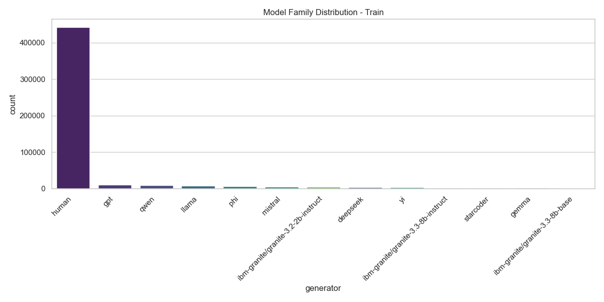
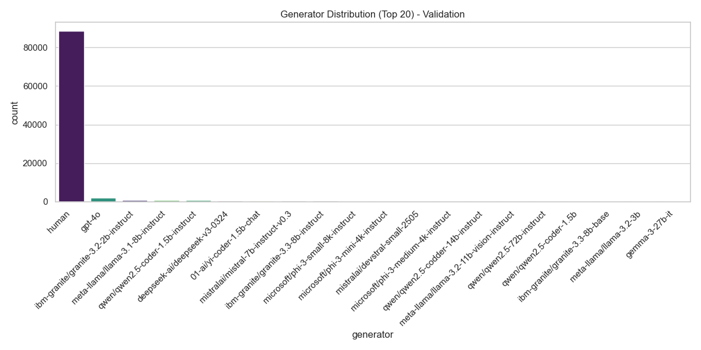
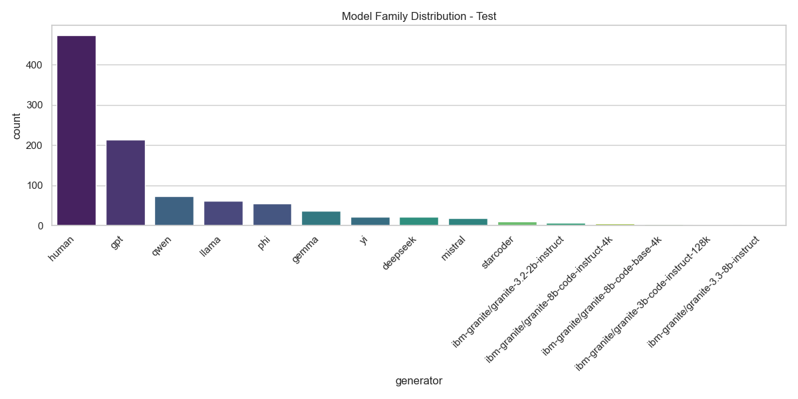
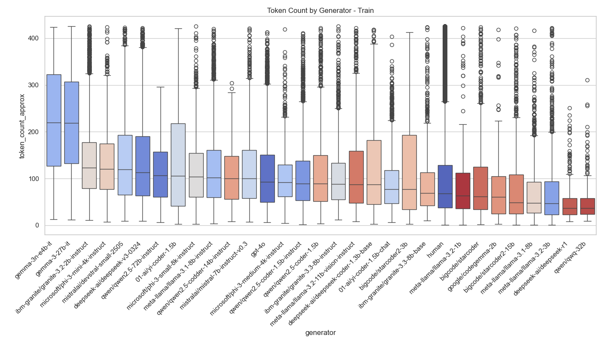
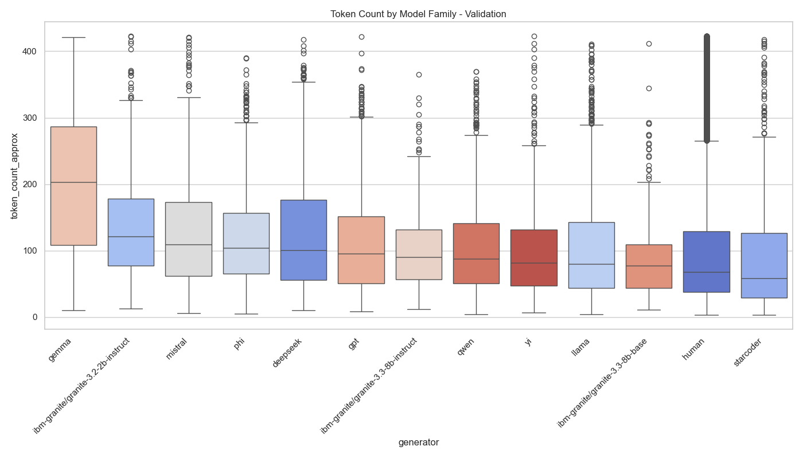
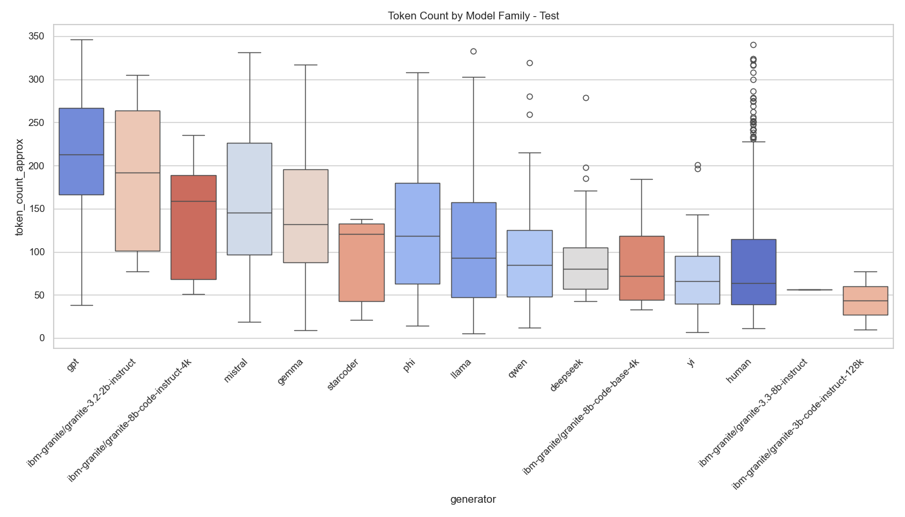
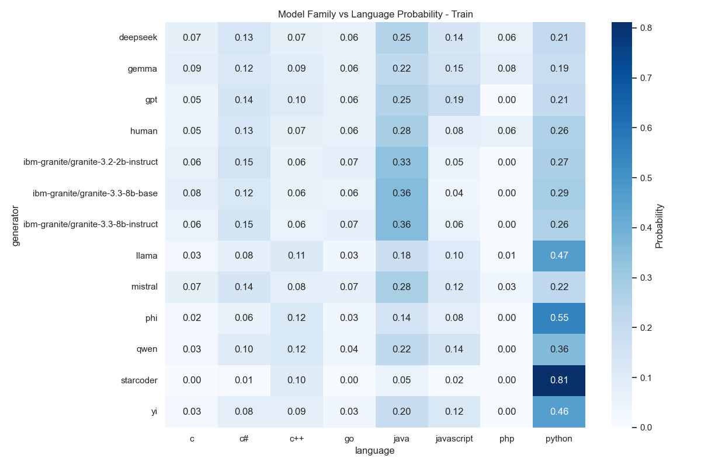
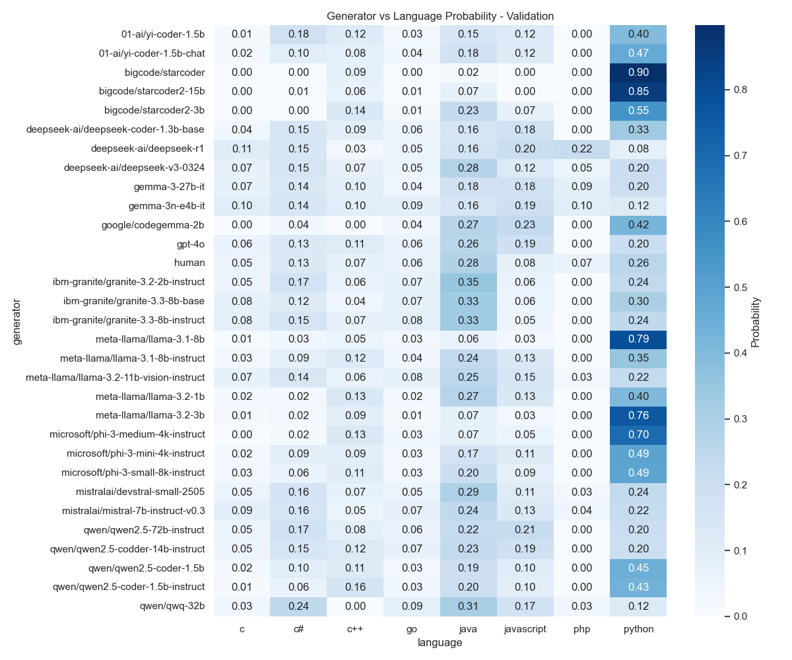
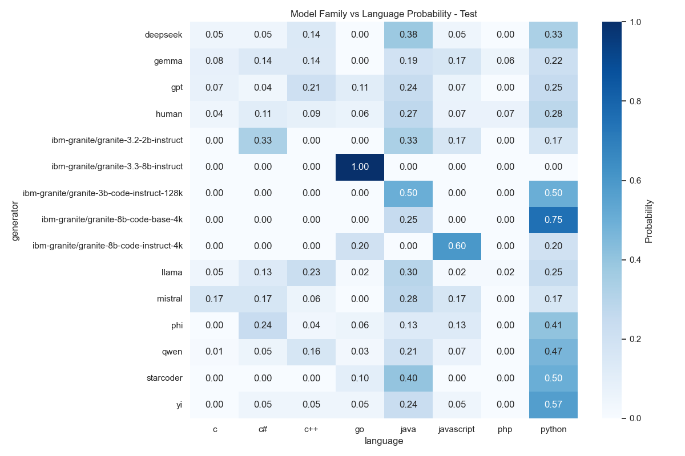
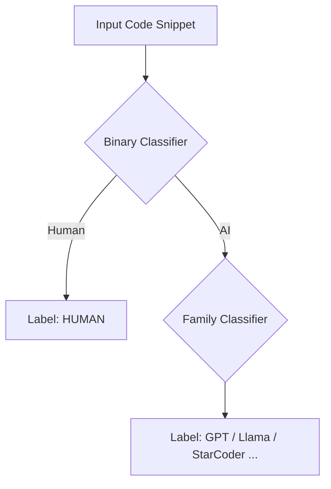

# SemEval-2026 Task 13: Subtask B - Multi-Class Authorship Detection

## 📌 Subtask B Objective

<div align="center">
  <a href="README.it.md">
    
  </a>
</div>

Unlike Subtask A (binary), **Subtask B** addresses a **Fine-Grained Classification** challenge. The goal is to identify **which specific author** (human or AI model) generated a given code snippet.

- **Labels:** 11 classes (e.g., `human`, `gpt-4o`, `llama-3.1-8b`, `starcoder`, etc.)
- **Input:** Multilingual source code snippets
- **Key Challenge:** The dataset exhibits strong imbalance and includes **OOD (Out-Of-Distribution)** scenarios.

The model must not only distinguish between known generators but also robustly handle the presence of models never seen during training in the test set.

| Setting | Generators | Objective |
| :--- | :--- | :--- |
| **In-Distribution (ID)** | Present in Train | Correctly classify the exact author |
| **Out-Of-Distribution (OOD)** | Absent in Train | Generalization or OOD Detection |
| **Class Imbalance** | Human >>> AI Models | Handle the dominance of the `human` class |

---

## 📝 Initial Dataset Analysis

To analyze the complexity of this multi-class task, the `info_dataset_subTaskB.py` script was developed to:

1.  Load datasets (Train, Validation, Test) and normalize generator labels.
2.  Perform a check for **duplicates** to avoid *data leakage* between sets.
3.  Generate advanced metrics such as (approximate) **token length** and **Language-Generator** correlation.
4.  Produce the `GENERATOR_MAP` dictionary required for the training phase.

---

### Examples of results saved in `img_TaskB`:

**1. Class Distribution (Train vs Validation)**
Highlights the strong imbalance towards the *Human* class and frequency differences among the various AI models.

<div style="text-align:center">
  
  
  
</div>

<br>

**2. Model Verbosity (Token Length)**
Comparison of the average length of produced code. Boxplots (sorted by median) show how some models (e.g., GPT-4o) tend to be more "verbose" than others.

<div style="text-align:center">
  
  
  
</div>

<br>

**3. Normalized Heatmap (Generator vs Language)**
Shows the conditional probability that a certain generator produces code in a specific language. Useful for identifying specialized models (e.g., Python-only) versus generalist ones.

<div style="text-align:center">
  
  
  
</div>

This information helps to understand:

- The need for **re-sampling** techniques or **weighted loss** given the imbalance.
- The importance of **code length** as a discriminating feature.
- The structure of correlations between models and programming languages.

---

## 🚀 Execution Instructions

### 1. Training

To start the training pipeline with logging to console, TensorBoard, and CometML:
```bash
python -m src.src_TaskB.train --mode binary
```

Subsequently, once the binary training is complete, run:
```bash
python -m src.src_TaskB.train --mode families
```

The output will include a progress bar with real-time metrics. The best model (based on Macro-F1) will be automatically saved in `results/results_TaskB/checkpoints/`.

### 2. Inference and Submission

To generate the valid `submission_task_b.csv` file for the leaderboard:
```bash
python -m src.src_TaskB.generate_submission \
  --test_file data/data_TaskB/test.parquet \
  --ckpt_binary results/results_TaskB/checkpoints/binary/best_model \
  --ckpt_families results/results_TaskB/checkpoints/families/best_model \
  --data_dir data/Task_B_Processed \
  --output_file results/results_TaskB/submission/submission_task_b.csv
```
The script automatically detects the `test.parquet` file (searching also within Kaggle download subfolders) and generates the file in `results/results_TaskB/submission/submission_task_b.csv`.

---

## ⚙️ Methodology and Architecture

To address the complexity of the task and the strong imbalance towards the *Human* class, a **Cascade Inference Pipeline** based on a hybrid neural architecture was implemented.

### 1. Cascade Ensemble Strategy

Instead of a single 11-class classifier, the problem was divided into two logical stages to maximize precision:



- **Stage 1 (Binary)**: A specialized model distinguishes only between `Human `vs `AI`. This protects against AI false positives on human code (the majority class).

- **Stage 2 (Families)**: If the first model predicts "AI", the snippet is passed to a second model trained exclusively on LLM families (excluding humans) to identify the specific family.

### 2. Custom Model Architecture

The core of the system is a custom `CodeClassifier` class that extends **UniXcoder-base** (`microsoft/unixcoder-base`) with specific components for authorship attribution:

- **Attention Pooling**: Instead of using only the `[CLS]` token, a weighted sum of all tokens is calculated based on their relevance, better capturing stylistic patterns diffused throughout the code.

- **Stylistic Features Injection**: **8 handcrafted stylistic features** are extracted (e.g., comment density, snake_case vs camelCase, average indentation, logical tokens) and projected into a latent space via a `StyleProjector`.

- **Feature Fusion**: The semantic embedding (UniXcoder) and the stylistic embedding are concatenated before classification.

### 3. Training Strategies

**Supervised Contrastive Learning (SupCon)**: During the Families training, a contrastive loss is used to pull snippets of the same family closer in vector space and push different ones apart, improving the separation between similar models (e.g., Llama vs Mistral).

**Focal Loss**: Used instead of standard CrossEntropy to penalize errors on hard/rare classes and handle dataset imbalance.

**Mixed Precision & Gradient Accumulation**: Training optimized in FP16 with gradient accumulation to simulate larger batch sizes on consumer GPUs.

---

## 📊 Repository Structure Sub Task-B

```bash
├── 📁 src
│   └── 📁 src_TaskB
│       ├── 📁 config
│       │   └── ⚙️ config.yaml
│       │
│       ├── 📁 dataset
│       │   ├── 🐍 Inference_dataset.py
│       │   ├── 🐍 dataset.py
│       │   └── 🐍 prepare_split_data.py
│       │
│       ├── 📁 models
│       │   └── 🐍 model.py
│       │
│       ├── 📁 utils
│       │   └── 🐍 utils.py
│       │
│       ├── 📝 README.md
│       │
│       ├── 🐍 generate_submission.py
│       ├── 🐍 inference.py
│       │
│       └── 🐍 train.py
```

---

<!--───────────────────────────────────────────────-->
<!--                   AUTORE                     -->
<!--───────────────────────────────────────────────-->

<h2 align="center">✨ Autore ✨</h2>

<p align="center">
  <strong>Giovanni Giuseppe Iacuzzo</strong><br>
  <em>Studente di Ingegneria Dell'IA e della CyberSecurity · Università degli Studi Kore di Enna</em>
</p>

<p align="center">
  <a href="https://github.com/giovanniIacuzzo" target="_blank">
    
  </a>
  <a href="mailto:giovanni.iacuzzo@unikorestudent.com">
    
  </a>
</p>
