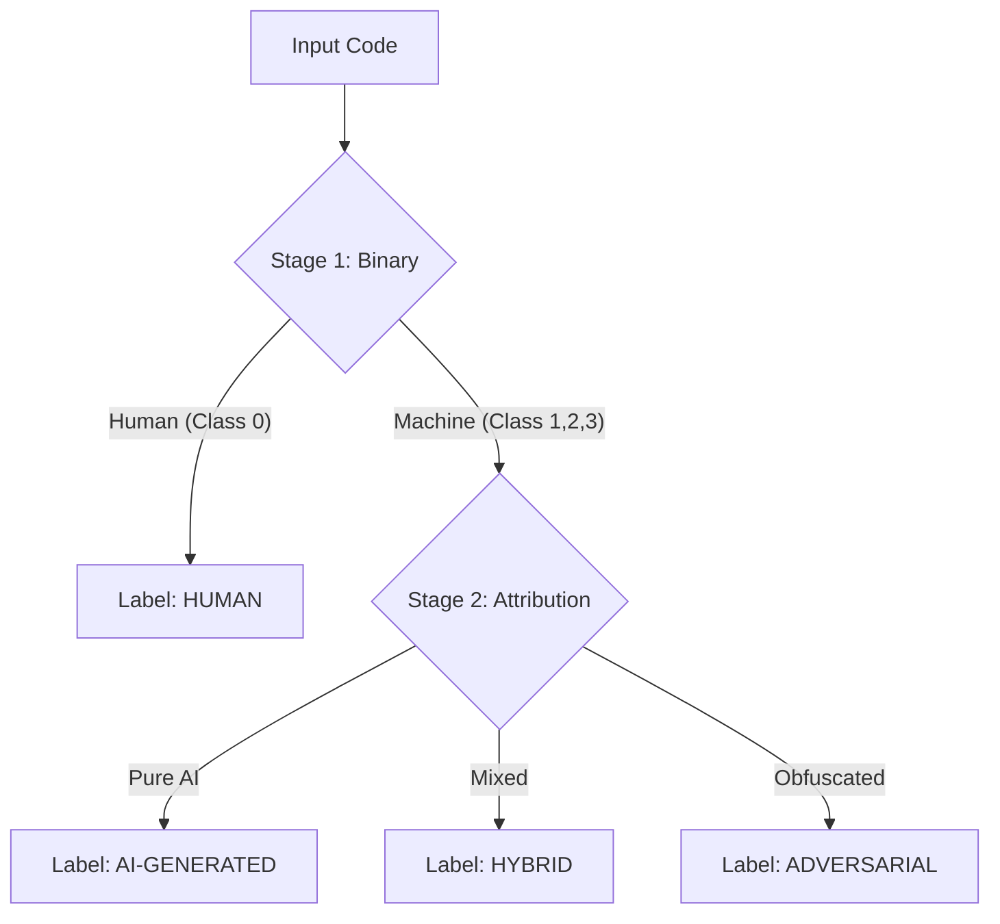

# SemEval-2026 Task 13: Subtask C - Mixed-Source & Code Modification Analysis

## 📌 Obiettivo del Subtask C

<div align="center">
  <a href="README.md">
    
  </a>
</div>

Il **Subtask C** introduce il livello più alto di complessità: l'analisi di codice **ibrido** o **modificato**. Non ci chiediamo più solo "chi l'ha scritto", ma analizziamo le sfumature di collaborazione tra Umano e Macchina (es. codice umano refactorizzato da AI, o codice AI corretto da umani).

- **Input:** Snippet di codice (con potenziali differenze/diff o versioni multiple).
- **Target:** Classificazione Ibrida o Regressione (es. identificare se il codice è stato modificato da una AI o assegnare un punteggio di "artificialità").
- **Sfida principale:** Rilevare pattern sottili di modifica che non alterano la logica del codice ma ne cambiano lo stile (Refactoring, Obfuscation, Translation).

| Setting | Tipo di Analisi | Obiettivo |
| :--- | :--- | :--- |
| **Mixed Sources** | Human + AI | Rilevare confini o percentuali di contributo AI |
| **Refactoring** | Original vs Modified | Capire se lo stile è stato alterato da un modello |
| **Soft-Labeling** | Score 0.0 - 1.0 | Assegnare un grado di certezza sull'origine |

---

## 📝 Analisi iniziale del dataset

Per affrontare la natura eterogenea di questo task, lo script `info_dataset_subTaskC.py` è stato progettato per adattarsi dinamicamente al tipo di target (categorico o numerico):

1.  Rileva automaticamente se il target è una **Classe** (Grafici a barre) o uno **Score** (Istogrammi/KDE).
2.  Analizza la lunghezza del codice gestendo gli outlier (taglio al 95° percentile).
3.  Esamina la distribuzione dei linguaggi per capire se il task di modifica è specifico per linguaggio o agnostico.

---

### Esempi di risultati salvati in `img_TaskC`:

**1. Distribuzione del Target (Label o Score)**
A differenza dei task precedenti, qui potremmo osservare distribuzioni continue (score di regressione) o classi ibride. Questo grafico è cruciale per scegliere la Loss Function (CrossEntropy vs MSE).

<div style="text-align:center">
  
  
  
</div>

<br>

**2. Distribuzione Lunghezza Codice (Cleaned)**
Analisi della lunghezza degli snippet (senza outlier estremi). In task di "Mixed-Source", la lunghezza può correlare con la probabilità di intervento dell'AI (le AI tendono a refactorizzare in modo conciso o verboso a seconda del prompt).

<div style="text-align:center">
  
  
  
</div>

<br>

**3. Linguaggi Predominanti**
Panoramica dei linguaggi coinvolti nel task di modifica/generazione ibrida.

<div style="text-align:center">
  
  
  
</div>

Queste informazioni aiutano a definire:

- Se trattare il problema come **Classificazione** o **Regressione**.
- Come gestire la **lunghezza del contesto** nei modelli Transformer (es. snippet molto lunghi potrebbero richiedere sliding windows).
- La strategia di **Data Augmentation** necessaria per coprire linguaggi meno rappresentati.

---

## ⚙️ Metodologia e Architettura
Il Subtask C rappresenta una sfida complessa: distinguere non solo tra Human e AI, ma identificare anche codice **Ibrido** (collaborazione uomo-macchina) e **Adversarial** (codice AI offuscato per evadere i detector). Per affrontare queste sfumature, è stata adottata una strategia di **Curriculum Learning** a Stadi supportata da un'architettura ibrida.

### 1. Staged Learning Strategy (Divide et Impera)

Invece di addestrare un singolo classificatore a 4 classi ("end-to-end") che spesso soffre sulle classi minoritarie, il training è stato modulato in fasi logiche (configurabili tramite parametro `--stage`), permettendo al modello di apprendere progressivamente concetti più difficili:


- **Stage 1 (Binary)**: Il modello impara a separare nettamente il codice puramente umano da tutto ciò che è sintetico o manipolato.

- **Stage 2 (Attribution)**: Il modello viene specializzato nel distinguere le sottili differenze tra AI pura, codice ibrido e codice avversario, sfruttando pesi delle classi ricalibrati dinamicamente.

### 2. Neural-Stylometric Architecture

Il modello `CodeClassifier`estende l'approccio ibrido utilizzato nel Task A, ma con componenti specifici per gestire la multi-classe sbilanciata:

- **Backbone**: `microsoft/unixcoder-base` con **Attention Pooling** per estrarre una rappresentazione semantica densa.

- **Style Projector**: Un modulo MLP (`Linear` -> `LayerNorm` -> `Mish`) proietta le 8 feature manuali (vedi punto 3) in uno spazio a 64 dimensioni.

- **SupCon Head**: Una testa di proiezione specifica per la Contrastive Loss che normalizza i vettori sulla ipersfera unitaria.

### 3. Lightweight Feature Extraction

Per il Subtask C, è stato sviluppato un estrattore ottimizzato (`ProcessPoolExecutor`) che calcola **8 feature rapide** particolarmente efficaci per rilevare codice **Adversarial** (spesso caratterizzato da alta entropia o strutture innaturali) e **Ibrido**:

  1. **Shannon Entropy**: Fondamentale per rilevare offuscamento (codice adversarial ad alta entropia).
  
  2. **Nesting Depth**: Profondità massima delle parentesi graffe (il codice umano complesso tende ad essere più profondo di quello AI standard).

  3. **Keyword Density**: Rapporto tra keyword del linguaggio e totale token.

  4. **Special Characters Ratio**: Densità di simboli (operatori, parentesi) rispetto al testo.

  5. **Long String Count**: Rileva stringhe lunghe (es. token o dati hardcodati tipici di codice generato/offuscato).

  6. **Avg Word Length**: Lunghezza media dei token.

  7. **Uniqueness Ratio**: Varietà del vocabolario usato nello snippet.

  8. **Spaces Ratio**: Densità di spazi bianchi (feature stilistica di formattazione).

### 4. Advanced Training Techniques

Dato il forte sbilanciamento delle classi (con Hybrid e Adversarial solitamente rare), sono state implementate tecniche di regolarizzazione aggressive:

- **Focal Loss Dinamica**: Al posto della `CrossEntropy`, viene utilizzata la `Focal Loss` (γ=2.0) pesata con l'inverso della frequenza delle classi (`compute_class_weight='balanced'`). Questo costringe il modello a concentrarsi sugli esempi "difficili" (Adversarial) riducendo il peso degli esempi facili (Human/AI).

- **Supervised Contrastive Learning (SupCon)**: Una loss ausiliaria (peso α=0.5) che avvicina nello spazio latente gli embedding della stessa classe (es. Adversarial con Adversarial) e allontana quelli di classi diverse, migliorando la separazione dei cluster prima della classificazione lineare.

- **Robust Data Loading**:

  - **Parallel Feature Extraction**: Pre-calcolo delle feature stilistiche sfruttando tutti i core della CPU.

  - **Random Cropping**: Data augmentation che estrae porzioni casuali da file lunghi invece di troncare sempre la fine, preservando informazioni strutturali diverse.

---

## 🚀 Istruzioni per l'Esecuzione

### 0. Inizio

Prima di avviare il train lanciare il codice per preparare le features:
```bash
python -m src.src_TaskC.dataset.prepare_data
python -m src.src_TaskC.dataset.preprocess_features
```

### 1. Addestramento

Per avviare la training pipeline con logging su console, TensorBoard e CometML:
```bash
python -m src.src_TaskC.train
```

L'output includerà una progress bar con metriche in tempo reale. Il miglior modello (basato su Macro-F1) verrà salvato automaticamente in `results/results_TaskC/checkpoints/`.

### 2. Inferenza e Sottomissione

Per generare il file `submission_task_c.csv` valido per la leaderboard:
```bash
python -m src.src_TaskC.generate_submission
```
Lo script rileva automaticamente il file `test.parquet` (cercandolo anche nelle sottocartelle di download Kaggle) e genera il file in `results/results_TaskC/submission/submission_task_c.csv`.

---

## 📊 Struttura del Progetto Sub Task-C

```bash
├── 📁 src
│   └── 📁 src_TaskC
│       ├── 📁 config
│       │   └── ⚙️ config.yaml
│       │
│       ├── 📁 dataset
│       │   ├── 🐍 Inference_dataset.py
│       │   ├── 🐍 prepare_data.py
│       │   ├── 🐍 preprocess_features.py
│       │   └── 🐍 dataset.py
│       │
│       ├── 📁 models
│       │   └── 🐍 model.py
│       │
│       ├── 📁 utils
│       │   └── 🐍 utils.py
│       │
│       ├── 📝 README.md
│       │
│       ├── 🐍 generate_submission.py
│       ├── 🐍 inference.py
│       │
│       └── 🐍 train.py
```

---

<!--───────────────────────────────────────────────-->
<!--                   AUTORE                     -->
<!--───────────────────────────────────────────────-->

<h2 align="center">✨ Autore ✨</h2>

<p align="center">
  <strong>Giovanni Giuseppe Iacuzzo</strong><br>
  <em>Studente di Ingegneria Dell'IA e della CyberSecurity · Università degli Studi Kore di Enna</em>
</p>

<p align="center">
  <a href="https://github.com/giovanniIacuzzo" target="_blank">
    
  </a>
  <a href="mailto:giovanni.iacuzzo@unikorestudent.com">
    
  </a>
</p>
