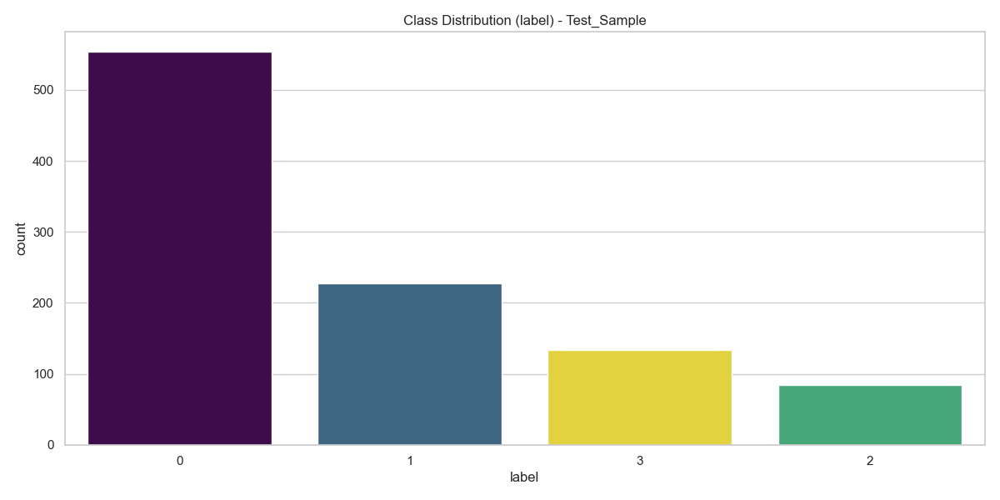
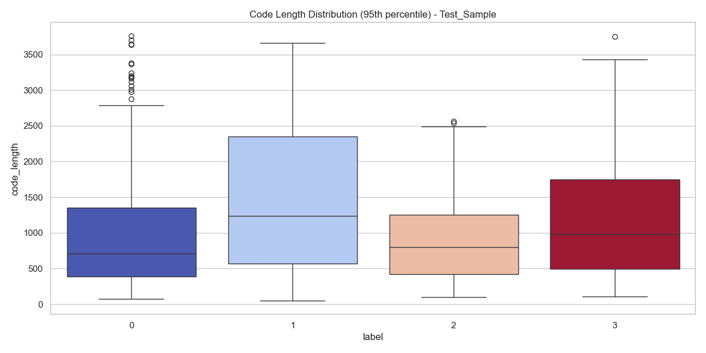
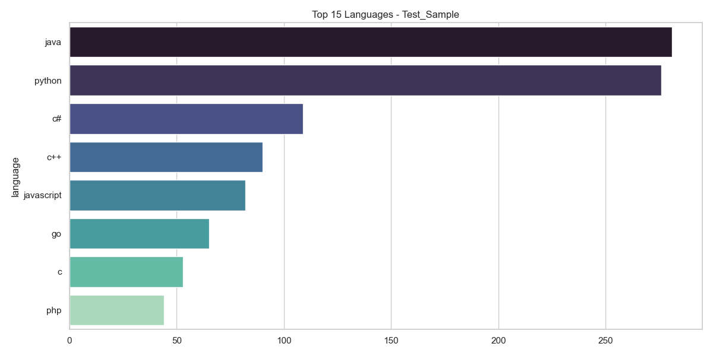
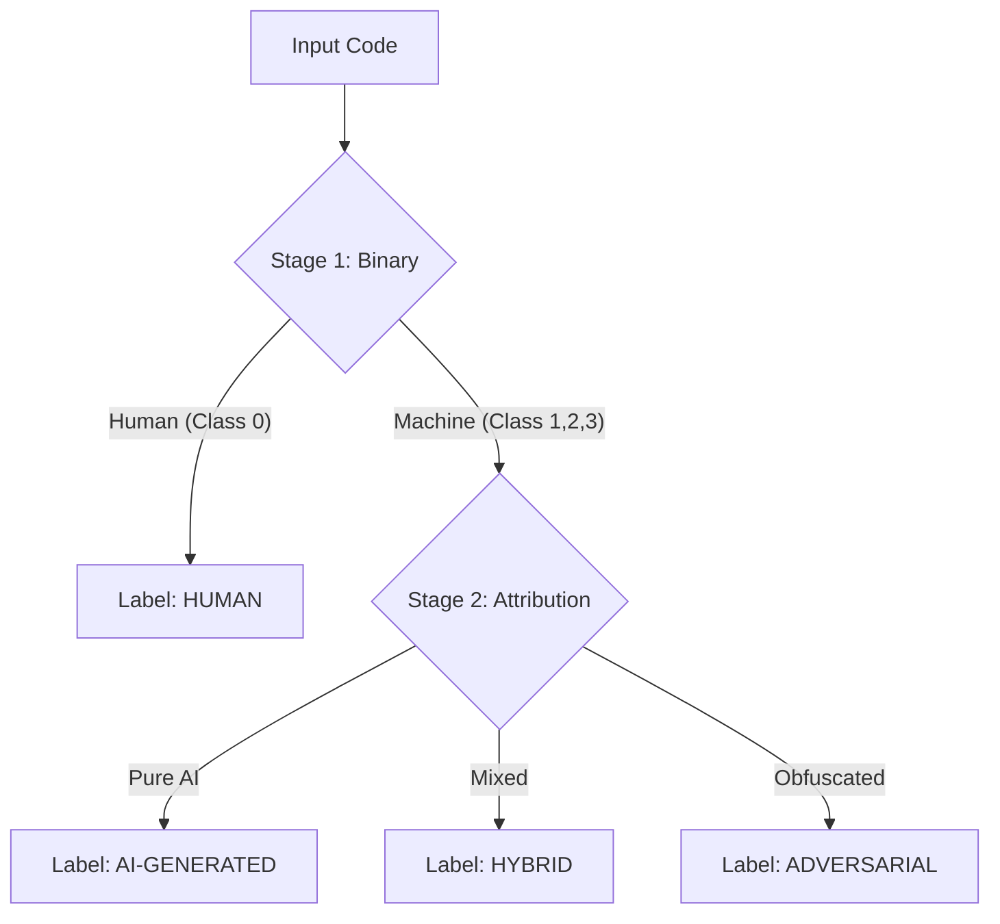

# SemEval-2026 Task 13: Subtask C - Mixed-Source & Code Modification Analysis

## 📌 Subtask C Objective

<div align="center">
  <a href="README.it.md">
    
  </a>
</div>

**Subtask C** introduces the highest level of complexity: the analysis of **hybrid** or **modified** code. We no longer ask just "who wrote it," but analyze the nuances of collaboration between Human and Machine (e.g., human code refactored by AI, or AI code fixed by humans).

- **Input:** Code snippets (with potential differences/diffs or multiple versions).
- **Target:** Hybrid Classification or Regression (e.g., identifying if code was modified by an AI or assigning an "artificiality" score).
- **Key Challenge:** Detecting subtle modification patterns that do not alter the code logic but change its style (Refactoring, Obfuscation, Translation).

| Setting | Analysis Type | Objective |
| :--- | :--- | :--- |
| **Mixed Sources** | Human + AI | Detect boundaries or AI contribution percentages |
| **Refactoring** | Original vs Modified | Understand if the style was altered by a model |
| **Soft-Labeling** | Score 0.0 - 1.0 | Assign a degree of certainty regarding the origin |

---

## 📝 Initial Dataset Analysis

To address the heterogeneous nature of this task, the `info_dataset_subTaskC.py` script was designed to dynamically adapt to the target type (categorical or numerical):

1.  Automatically detects if the target is a **Class** (Bar charts) or a **Score** (Histograms/KDE).
2.  Analyzes code length while handling outliers (95th percentile cut-off).
3.  Examines language distribution to understand if the modification task is language-specific or agnostic.

---

### Examples of results saved in `img_TaskC`:

**1. Target Distribution (Label or Score)**
Unlike previous tasks, here we might observe continuous distributions (regression scores) or hybrid classes. This chart is crucial for choosing the Loss Function (CrossEntropy vs MSE).

<div style="text-align:center">
  
  
  
</div>

<br>

**2. Code Length Distribution (Cleaned)**
Analysis of snippet lengths (excluding extreme outliers). In "Mixed-Source" tasks, length can correlate with the likelihood of AI intervention (AIs tend to refactor concisely or verbosely depending on the prompt).

<div style="text-align:center">
  
  
  
</div>

<br>

**3. Predominant Languages**
Overview of the languages involved in the hybrid modification/generation task.

<div style="text-align:center">
  
  
  
</div>

This information helps to define:

- Whether to treat the problem as **Classification** or **Regression**.
- How to manage **context length** in Transformer models (e.g., very long snippets might require sliding windows).
- The **Data Augmentation** strategy needed to cover less represented languages.

---

## ⚙️ Methodology and Architecture
Subtask C represents a complex challenge: distinguishing not only between Human and AI but also identifying **Hybrid** code (human-machine collaboration) and **Adversarial** code (AI code obfuscated to evade detectors). To address these nuances, a Staged **Curriculum Learning** strategy was adopted, supported by a hybrid architecture.

### 1. Staged Learning Strategy (Divide and Conquer)

Instead of training a single 4-class classifier ("end-to-end"), which often struggles with minority classes, the training was structured into logical phases (configurable via the `--stage` parameter), allowing the model to progressively learn more difficult concepts:



- **Stage 1 (Binary)**: The model learns to clearly separate purely human code from everything that is synthetic or manipulated.

- **Stage 2 (Attribution)**: The model specializes in distinguishing the subtle differences between pure AI, hybrid code, and adversarial code, leveraging dynamically recalibrated class weights.

### 2. Neural-Stylometric Architecture

The `CodeClassifier` model extends the hybrid approach used in Task A, but with specific components to handle the imbalanced multi-class scenario:

- **Backbone**: `microsoft/unixcoder-base` with **Attention Pooling** to extract a dense semantic representation.

- **Style Projector**: An MLP module (`Linear` -> `LayerNorm` -> `Mish`) projects the 8 manual features (see point 3) into a 64-dimensional space.

- **SupCon Head**: A projection head specific for the Contrastive Loss that normalizes vectors onto the unit hypersphere.

### 3. Lightweight Feature Extraction

For Subtask C, an optimized extractor (`ProcessPoolExecutor`) was developed that calculates **8 rapid features** particularly effective for detecting **Adversarial** code (often characterized by high entropy or unnatural structures) and **Hybrid** code:

  1. **Shannon Entropy**: Fundamental for detecting obfuscation (high entropy adversarial code).
  
  2. **Nesting Depth**: Maximum depth of curly braces (complex human code tends to be deeper than standard AI code).

  3. **Keyword Density**: Ratio between language keywords and total tokens.

  4. **Special Characters Ratio**: Density of symbols (operators, parentheses) relative to text.

  5. **Long String Count**: Detects long strings (e.g., tokens or hardcoded data typical of generated/obfuscated code).

  6. **Avg Word Length**: Average token length.

  7. **Uniqueness Ratio**: Variety of vocabulary used in the snippet.

  8. **Spaces Ratio**: Density of white spaces (stylistic formatting feature).

### 4. Advanced Training Techniques

Given the strong class imbalance (with Hybrid and Adversarial usually being rare), aggressive regularization techniques were implemented:

- **Dynamic Focal Loss**: Instead of `CrossEntropy`, `Focal Loss` (γ=2.0) is used, weighted with the inverse of class frequency (`compute_class_weight='balanced'`). This forces the model to focus on "hard" examples (Adversarial) while reducing the weight of easy examples (Human/AI).

- **Supervised Contrastive Learning (SupCon)**: An auxiliary loss (weight α=0.5) that pulls embeddings of the same class closer in latent space (e.g., Adversarial with Adversarial) and pushes away those of different classes, improving cluster separation before linear classification.

- **Robust Data Loading**:

  - **Parallel Feature Extraction**: Pre-computation of stylistic features leveraging all CPU cores.

  - **Random Cropping**: Data augmentation that extracts random portions from long files instead of always truncating the end, preserving diverse structural information.

---

## 🚀 Execution Instructions

### 0. Initialization

Before starting the training, run the code to prepare the features:
```bash
python -m src.src_TaskC.dataset.prepare_data
python -m src.src_TaskC.dataset.preprocess_features
```

### 1. Training

To start the training pipeline with logging to console, TensorBoard, and CometML:
```bash
python -m src.src_TaskC.train
```

The output will include a progress bar with real-time metrics. The best model (based on Macro-F1) will be automatically saved in `results/results_TaskC/checkpoints/`.

### 2. Inference and Submission

Per generare il file `submission_task_c.csv` file for the leaderboard:
```bash
python -m src.src_TaskC.generate_submission
```
The script automatically detects the `test.parquet` file (searching also within Kaggle download subfolders) and generates the file in `results/results_TaskC/submission/submission_task_c.csv`.

---

## 📊 Repository Structure Sub Task-C

```bash
├── 📁 src
│   └── 📁 src_TaskC
│       ├── 📁 config
│       │   └── ⚙️ config.yaml
│       │
│       ├── 📁 dataset
│       │   ├── 🐍 Inference_dataset.py
│       │   ├── 🐍 prepare_data.py
│       │   ├── 🐍 preprocess_features.py
│       │   └── 🐍 dataset.py
│       │
│       ├── 📁 models
│       │   └── 🐍 model.py
│       │
│       ├── 📁 utils
│       │   └── 🐍 utils.py
│       │
│       ├── 📝 README.md
│       │
│       ├── 🐍 generate_submission.py
│       ├── 🐍 inference.py
│       │
│       └── 🐍 train.py
```

---

<!--───────────────────────────────────────────────-->
<!--                   AUTORE                     -->
<!--───────────────────────────────────────────────-->

<div align="center">
  <h2>✨ Autore ✨</h2>

  <p>
    <strong>Giovanni Giuseppe Iacuzzo</strong><br>
    <em>AI & Cybersecurity Engineering Student</em><br>
    <em>University of Kore, Enna</em>
  </p>

  <p>
    <a href="https://github.com/giovanniIacuzzo" target="_blank">
      
    </a>
    <a href="mailto:giovanni.iacuzzo@unikorestudent.com">
      
    </a>
  </p>
</div>
