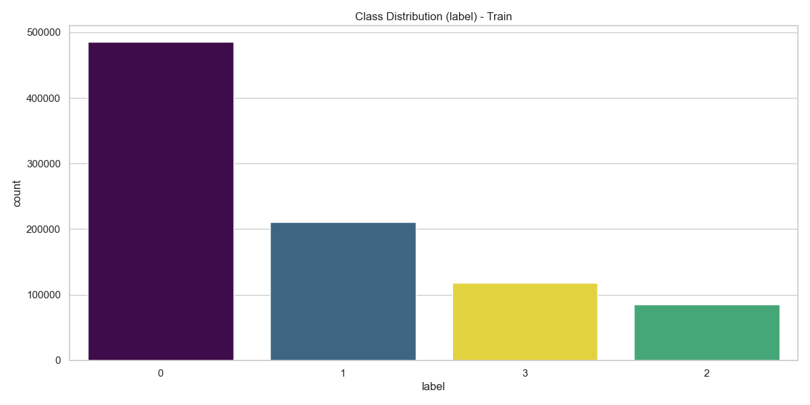
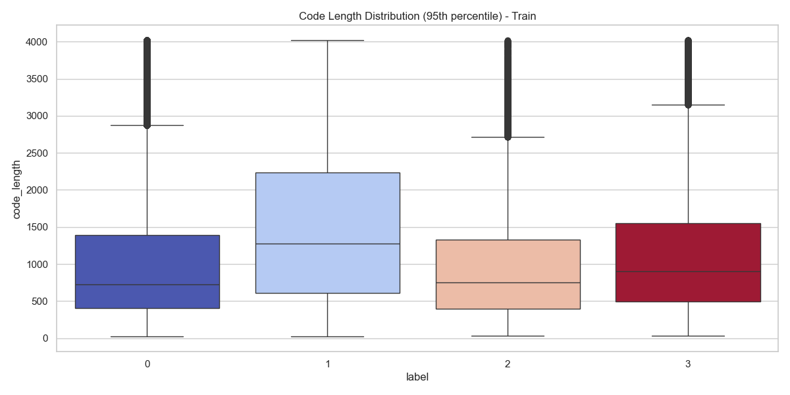
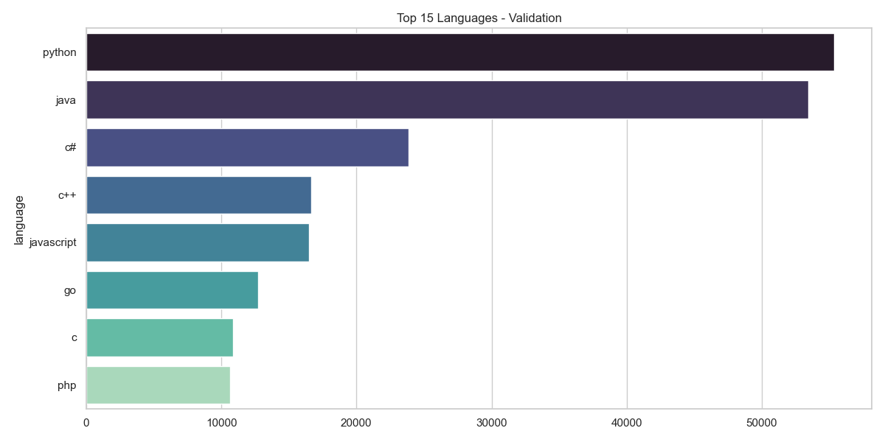

# SemEval-2026 Task 13: Subtask C - Mixed-Source & Code Modification Analysis

## 📌 Obiettivo del Subtask C

Il **Subtask C** introduce il livello più alto di complessità: l'analisi di codice **ibrido** o **modificato**. Non ci chiediamo più solo "chi l'ha scritto", ma analizziamo le sfumature di collaborazione tra Umano e Macchina (es. codice umano refactorizzato da AI, o codice AI corretto da umani).

- **Input:** Snippet di codice (con potenziali differenze/diff o versioni multiple).
- **Target:** Classificazione Ibrida o Regressione (es. identificare se il codice è stato modificato da una AI o assegnare un punteggio di "artificialità").
- **Sfida principale:** Rilevare pattern sottili di modifica che non alterano la logica del codice ma ne cambiano lo stile (Refactoring, Obfuscation, Translation).

| Setting | Tipo di Analisi | Obiettivo |
| :--- | :--- | :--- |
| **Mixed Sources** | Human + AI | Rilevare confini o percentuali di contributo AI |
| **Refactoring** | Original vs Modified | Capire se lo stile è stato alterato da un modello |
| **Soft-Labeling** | Score 0.0 - 1.0 | Assegnare un grado di certezza sull'origine |

---

## 📝 Analisi iniziale del dataset

Per affrontare la natura eterogenea di questo task, lo script `info_dataset_subTaskC.py` è stato progettato per adattarsi dinamicamente al tipo di target (categorico o numerico):

1.  Rileva automaticamente se il target è una **Classe** (Grafici a barre) o uno **Score** (Istogrammi/KDE).
2.  Analizza la lunghezza del codice gestendo gli outlier (taglio al 95° percentile).
3.  Esamina la distribuzione dei linguaggi per capire se il task di modifica è specifico per linguaggio o agnostico.

---

### Esempi di risultati salvati in `img_TaskC`:

**1. Distribuzione del Target (Label o Score)**
A differenza dei task precedenti, qui potremmo osservare distribuzioni continue (score di regressione) o classi ibride. Questo grafico è cruciale per scegliere la Loss Function (CrossEntropy vs MSE).

  
  

 

**2. Distribuzione Lunghezza Codice (Cleaned)**
Analisi della lunghezza degli snippet (senza outlier estremi). In task di "Mixed-Source", la lunghezza può correlare con la probabilità di intervento dell'AI (le AI tendono a refactorizzare in modo conciso o verboso a seconda del prompt).

  
  

 

**3. Linguaggi Predominanti**
Panoramica dei linguaggi coinvolti nel task di modifica/generazione ibrida.

  
  

Queste informazioni aiutano a definire:

- Se trattare il problema come **Classificazione** o **Regressione**.
- Come gestire la **lunghezza del contesto** nei modelli Transformer (es. snippet molto lunghi potrebbero richiedere sliding windows).
- La strategia di **Data Augmentation** necessaria per coprire linguaggi meno rappresentati.

---

> [!CAUTION]
> README ANCORA IN FASE DI SVILUPPO...

---

<!--───────────────────────────────────────────────-->
<!--                   AUTORE                     -->
<!--───────────────────────────────────────────────-->

<h2 align="center">✨ Autore ✨</h2>

  <strong>Giovanni Giuseppe Iacuzzo</strong> 
  <em>Studente di Ingegneria Dell'IA e della CyberSecurity · Università degli Studi Kore di Enna</em>

  
  

